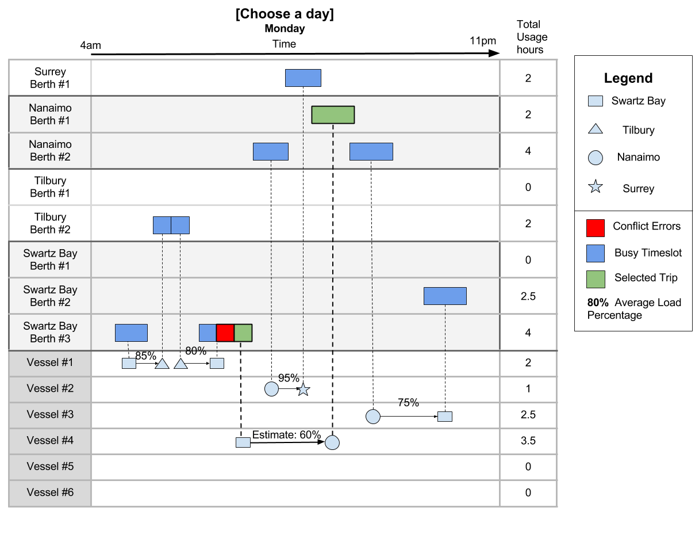

# Activity 2: Seaspan What-Why-How & Design Study

For: CSC 511 Dr. Storey

Date: Jan 11, 2018

Students: Joe Czepil (V00774878), Ying Wang (V00890482), Jorin Weatherston (V00711046)

## What-Why-How

We initially use the What-Why-How process to understand the problem space, design a solution, and evaluate our visualization.

### What

The data of this visualization are vessel, time, location and routes. The data types are:

* Vessels: items

* Time and date: Attributes

* Location and berth: Positions

* Routes: Links

The dataset could be tables, networks, geometry where table consists of vessels, time, and location, network consists of location and routes, geometry consists of location and routes. Dataset availability can be static if all the data have been assigned to a static graph and also can be dynamic because Seaspan can change the data if a visualization tool is built. As for attributes types, vessel and location can be categorized, time and date belongs to ordered type and the ordering direction is sequential, usage hour of vessels and berth can be quantitated. Based on this, the transformation data can be the average load percentage of vessel calculated based on past routes. For a new route, it is possible to estimate the load percentage of the vessel. The total usage hour of each vessel and each berth can also be transferred and shown.

### Why

Seaspan is hoping to accomplish something with the visualization of their data. This is their "why?". We can understand why they are interested in the visualization through task abstraction. We outline some high level goals and information that is important to our problem space.

* Seaspan goals:

    * Want to adapt schedule based on load information

    * Want to have control over schedule

    * Want to explore new schedules

* Critical information to display:

    * What vessels are doing and when

    * How full is each sailing

    * When is each berth occupied or free

Based on the business goals Seaspan has, we can say that they would like to both consume and produce schedule and resource data through a new visualization. The current tabular rendering of the schedule data does not support inspecting the schedules for re-orderings, open time slots, or available resources. They also do not have clear temporal axes, or collect the actors of vessels, berths, and trips in a summative form. Thus, the new visualization should support discovering desired characteristics in the schedules. But it should also permit the user to produce new schedules that enable efficient resource utilization and that meet the stated business goals. 

An example user flow would be to enable the user to locate scheduling dependencies, browse the distribution of scheduled sailings for openings, and produce a new sailing where under-utilized resources permit, all through our visualization.

### How

Now that it has been determined what data is being represented and why it is being represented that way, we can look into how we communicate the information effectively. Below is a basic mock-up of a potential solution to the problem. Assumptions and possible interactions are discussed below the image.

**Image 1: Mockup**

* Trips can be illustrated with arrows between shapes where each shape represents a location. The shapes allow the user to quickly interpret the data visualization.

* At a glance, you can determine where a ship is leaving from, where it is going, what time it leaves, what time it arrives, how full it is, and what vessel it is.

* The user would be able to drag trips horizontally in time in order to view different possible times in the schedule. Conflicts with berth’s in use would be highlighted and the user would be alerted.

* Algorithms could be designed to make approximate guesses on how effective changes are in the schedule while the user is editing possible trips, creating new trips, or deleting trips (Ex. Estimate: 60%).

* The red highlighted area in the Swartz Bay Berth #3 row signifies that either the Vessel #4 or Vessel #1 trip has to be changed as the berth has a conflict.

* The dashed vertical areas to connect vessel destinations and berths could quickly become cluttered. Those could be removed from the interface except for on the vessel that is selected.

* Berths being used for a given trip could be dragged up and down in order to change the berths assigned to a vessel.

* Using average load percentage instead of current load percentage allows the user to make a decision based off the average load while that schedule has been in place.

Notes

* The choose day option states Monday, January 21st but instead of choosing a specific day, days of the week could be the options (Monday, Tuesday, etc) as Monday the 21st would likely be the same as Monday the 28th.

## Design study

Another approach to creating a visualization for this use case would involve applying the design study methodology to our problem. This method involves following three major stages, each with substages, where should any substage fail to pass assessment against defined common pitfalls reversion to previous substages is possible. 

### Precondition

The first stage is to precondition our minds and knowledge such that we are able to apply established visualization concepts to problems effectively. This stage contains three substages of learning, winnowing, and casting. Learning involves reviewing and understanding visualization literature, winnowing is the process of isolating the collaborators we think are essential to our visualization-generating process, and casting takes those individuals and giving them explicit roles.

In our course we are visualization novices and so learning has only just begun. We formed our activity teams without prior knowledge of the winnowing step and so we chose our friends or colleagues. Casting was done to assign work for the assignment, but based only on an equal-workload basis. 

Pitfalls from these three substages related to our visualization could include PF-5 - Insufficient time available with potential collaborators and PF-12 - Not identifying front line analyst and gatekeeper before start, among others. Also PF-8 no need for research since we are doing very practical visualizations that aren’t new in any meaningful way. Little time was allotted to discuss and research for the given design which could lead to errors. No front line analyst or gatekeeper was decided before the project began, which is a major pitfall.

### Core

The second stage is to perform inward-facing validation. This stage contains the substages of discovery, design, implementation, and deploying. Discovery involves exploring the problem space, conceptualizing about business goals, and abstracting salient data concepts. Design takes the results of the discover phase and tries to contextualize them together in a representation that satisfies the goals and requirements of the main stakeholder. The remaining substages were not performed due to time and resource constraints, but include implementing the concept through prototypes, and then deploying an initial version of the visualization.

In our Seaspan case we explored the business goals, assessed the existing unsatisfactory visualizations, abstracted desirable visualization elements and qualities, and found analogous BCFerries visualizations to draw inspiration from. We then generated a set of possible visualization prototypes on paper and selected one to pursue. In this Seaspan problem analysis we performed most of the discovery substage, and rudimentary design. Beyond these initial substages would require actually developing real assets beyond the inclass requirements of the assignment, and so were not followed through.

Pitfalls from the discovery and basic design substages related to our visualization could include PF-15 - Ignoring practices that currently work well and PF-19 - Spending little time on abstraction, among others. Tables are often used for scheduling and that solution was quickly overlooked during this task. Initially with this task we quickly jumped to thinking of new ideas to solve the problem rather than thinking of all possible representations of the data. 

## Justifications

In determining our approach we looked to existing ferry schedules to understand the stakeholders, possible visualizations, and see effective data structuring being used in industry. We found a tabular schedule [http://www.bcferries.com/schedules/mainland/tssw-current.php](http://www.bcferries.com/schedules/mainland/tssw-current.php), real time departure and arrivals [http://www.bcferries.com/current_conditions/arrivals-departures.html?dept=TSA&route=01](http://www.bcferries.com/current_conditions/arrivals-departures.html?dept=TSA&route=01), and a map overlaid with berths, ship positions, and ship names [http://orca.bcferries.com:8080/cc/settings/includes/maps/route0.html](http://orca.bcferries.com:8080/cc/settings/includes/maps/route0.html). We think that our visualization fits in between these examples, and that it facilitates the necessary actions enabling production of new schedules based on a modifiable and interactive visualization. 

## Assumptions

We assumed that:

* Seaspan does not want to change schedules on-the-fly on the day they are viewing data.

* Seaspan is making changes to schedules far in the future.

* Seaspan is employing people without technical backgrounds so the data must be presented simply.

